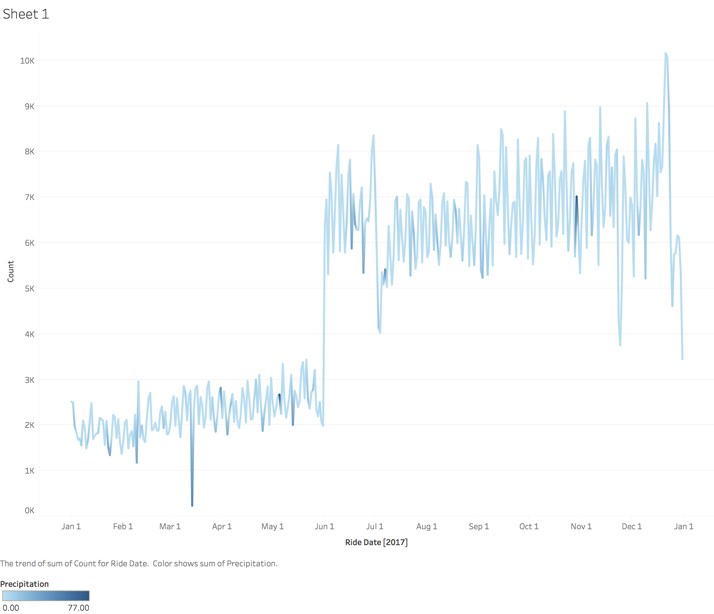

# Taxi Experiment

The Taxi Experiment focuses on a task to work on NYC's public taxi data set and to find out some things.
One main focus is to build up the code and automate it a little, so it can be run anywhere without bigger issues.
The other first idea's focus is on whether the percipitation (e.g. rain) influences the amount of people using taxis to get to the JFK airport. This should be prooven by calculating the correlation in between those both attributes.
Short answer to this idea: NO, percipitation has very low impact on wheter people leave the city by airplane, the overall temperature gets a lot stronger correlation for this, but one could also assume that people not just leave because of the temperature, but in general go into holidays in summer time most (which cannot be shown with this application).

## Prerequesits

1. The programm contains some simple shell scripts to download taxi data from internet. For this being able to work, it is required to not use proxy settings, otherwise the programm might need to be adjusted.
2. Has to be run on a Linux machine (/bin/bash available)
3. Requires installation of: JDK 1.8, Scala 2.11.8, Spark 2.3
4. Spark needs to be available at the system (extracted downloaded archive is sufficient for this). You will need to provide the path of the Spark's home folder to the program.

## Data sources

1. Taxi data from http://www.nyc.gov/html/tlc/html/about/trip_record_data.shtml
2. Lookup table for NYC zones and location IDs (also from the above source)
3. Weather data from Central Park's weather station https://www.ncdc.noaa.gov/cdo-web/datasets/GHCND/stations/GHCND:USW00094728/detail

### Data selection used

Since the amount of total data from FHV, Green and Yellow are big amounts and as data is from of these gathered taxi trips are only available for some years, I did choose to only use the data from 2017 (and exclude any older data). Hopefully this selection can provide most valueable results.
Also just in 2017 the quality of data was increased by adding more flags, FHV before had just on location ID, etc.
By this the volume of data shrinks down from 150 GB to about 20 GB.
For using the whole data set, adjustments might be required, by the logic and scalability of the program is not affected.

# How to run it

1. Get these sources to your local machine, to any path.
2. Run ``` mvn package ``` inside the root level of this projects files. This will build the Archive containing all scripts and libraries required to run it on your local Spark environment.
3. Get the compiled application archive from ``` target/taxi-experiment-1.0.0-bin.zip ``` and extract it to a folder where you want to run the application (note: it will download about 21 GB to this location, make sure enough space is available.
4. Go into the extracted archive location and run ``` ./run.sh <the (absolute) path to your Spark runtime (extracted from tar.gz.)> ``` (scirpt shows an example call if you don't provide the parameter)

If everything runs find (and all installed versions are available, no proxy for internet connection required, etc.) you will see the final output like:
```
➜  taxi-experiment-1.0.0 ./run.sh ~/Downloads/spark-2.3.2-bin-hadoop2.7/

... (long outout from downloads and Spark in between) ...

Program done
see results at 'results.csv' in this folder
listing cotents:
year,corr_count_prcp,corr_count_SNOW,corr_count_SNWD,corr_count_TMAX,corr_count_TMIN,corr_count_AWND
2017,-0.11645545836511625,-0.1418085060562601,-0.17093807972749042,0.39231237911798966,0.41336694794224577,-0.38590880278731704
```

The program will also create two new CSV files, one containing the correlation output (``` results.csv ```), the other containing the joined and pre-filtered data set base (``` rides-and-weather.csv ```)for calculating the correlations.
The second file is used by the accompanying Tableau workbook (``` percipitation.twb ```, will require Tableau desktop installation), that might be used for visualizations, like shown in the picture (``` percipitation.png ```)


